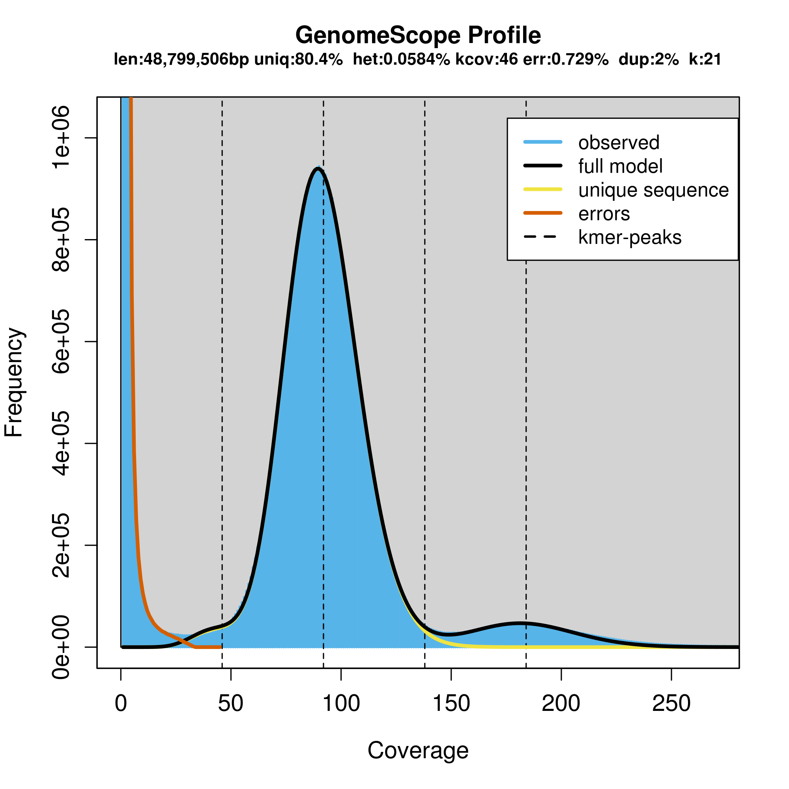
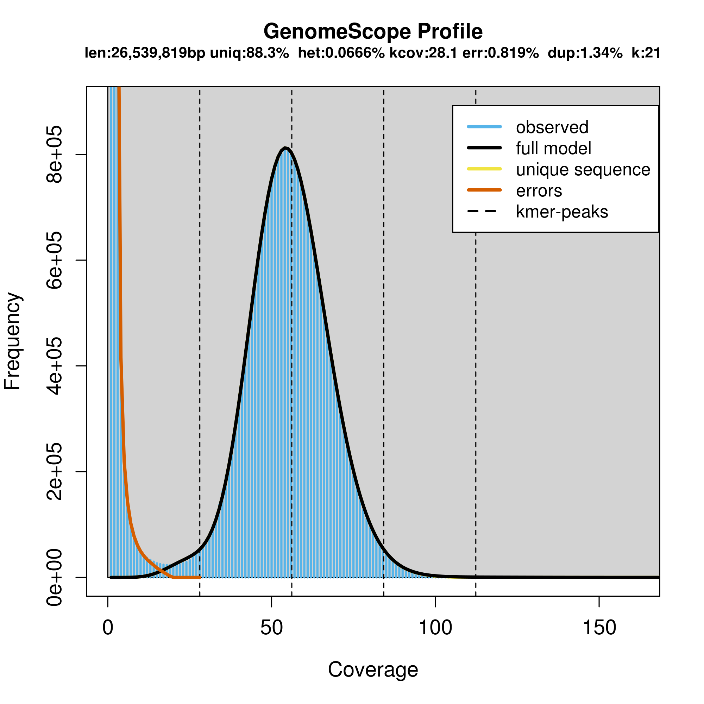
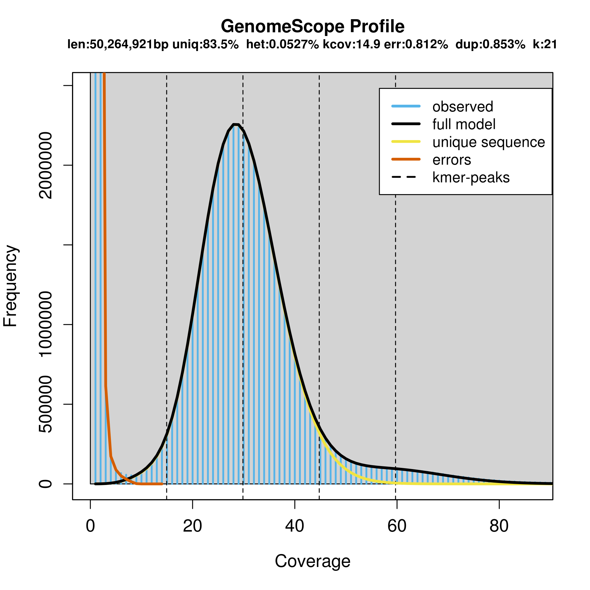
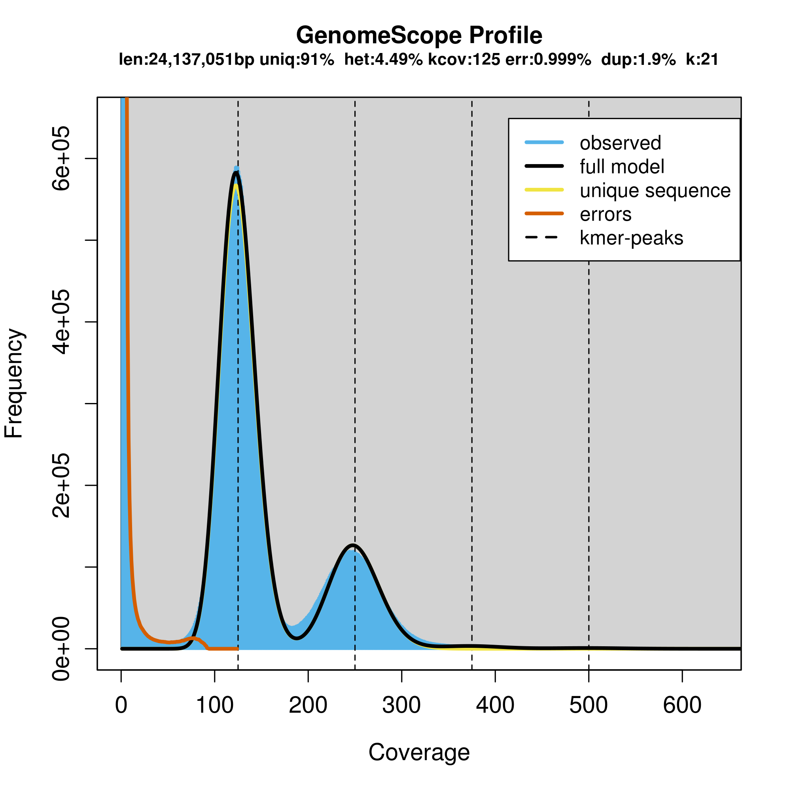
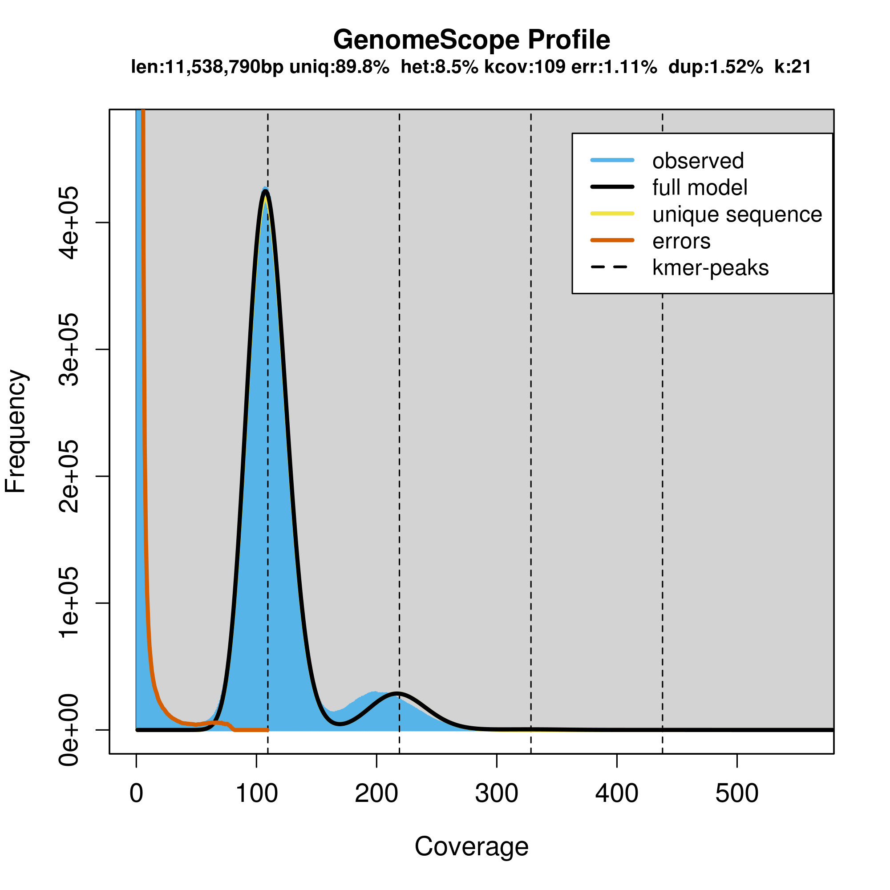

#Examine Heterozygosity among Antarctic isolates using kmer analysis of reads

## Genomescope 
This approach uses [GenomeScope](http://genomescope.org/) and the [source code](https://github.com/schatzlab/genomescope) to examine kmer distribution and examine likely ploidy and duplication within the data.

### Results

* **Exophiala_mesophila** [plot](Genomescope/Exophiala_mesophila/plot.png) [log plot](Genomescope/Exophiala_mesophila/plot.log.png) [summary](Genomescope/Exophiala_mesophila/summary.txt)

* **Cryomyces_minteri** [plot](Genomescope/Cryomyces_minteri/plot.png) [log plot](Genomescope/Cryomyces_minteri/plot.log.png) [summary](Genomescope/Cryomyces_minteri/summary.txt)

* **Friedmanniomyces_endolithicus** [plot](Genomescope/Friedmanniomyces_endolithicus/plot.png) [log plot](Genomescope/Friedmanniomyces_endolithicus/plot.log.png) [summary](Genomescope/Friedmanniomyces_endolithicus/summary.txt)

**Friedmanniomyces_simplex** [plot](Genomescope/Friedmanniomyces_simplex/plot.png) [log plot](Genomescope/Friedmanniomyces_simplex/plot.log.png) [summary](Genomescope/Friedmanniomyces_simplex/summary.txt)

**Hortaea_thailandica** [plot](Genomescope/Hortaea_thailandica/plot.png) [log plot](Genomescope/Hortaea_thailandica/plot.log.png) [summary](Genomescope/Hortaea_thailandica/summary.txt)

   
*Rachicladosporium_antarcticum** [plot](Genomescope/Rachicladosporium_antarcticum/plot.png) [log plot](Genomescope/Rachicladosporium_antarcticum/plot.log.png) [summary](Genomescope/Rachicladosporium_antarcticum/summary.txt)

   
**Rachicladosporium_sp._CCFEE_5018** [plot](Genomescope/Rachicladosporium_sp._CCFEE_5018/plot.png) [log plot](Genomescope/Rachicladosporium_sp._CCFEE_5018/plot.log.png) [summary](Genomescope/Rachicladosporium_sp._CCFEE_5018/summary.txt)

   
**Rhodotorula_sp._CCFEE_5036** [plot](Genomescope/Rhodotorula_sp._CCFEE_5036/plot.png) [log plot](Genomescope/Rhodotorula_sp._CCFEE_5036/plot.log.png) [summary](Genomescope/Rhodotorula_sp._CCFEE_5036/summary.txt)

